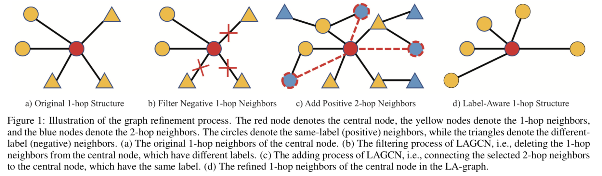

# Official Code LAGCN

### Motivation

### Code details

There are two parts of LAGCN, one is the training of the edge classifier, one is using the edge classifier to refine the whole graph. After refining the graph, we provide 5 models to test the performance of the LA-graph.

First, cd into the` LAGCN/` folder and then use `python train_edge.py --dataset xxx --method xxx` to train the edge classifier.

After that, use `python edge_enhance.py --dataset xxx --method xxx` to refine the graph with the trained edge classifier.